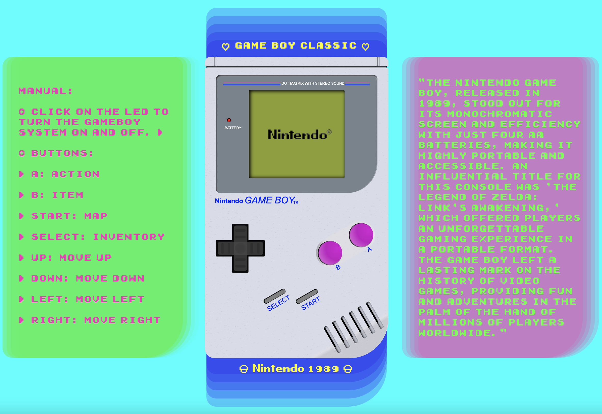
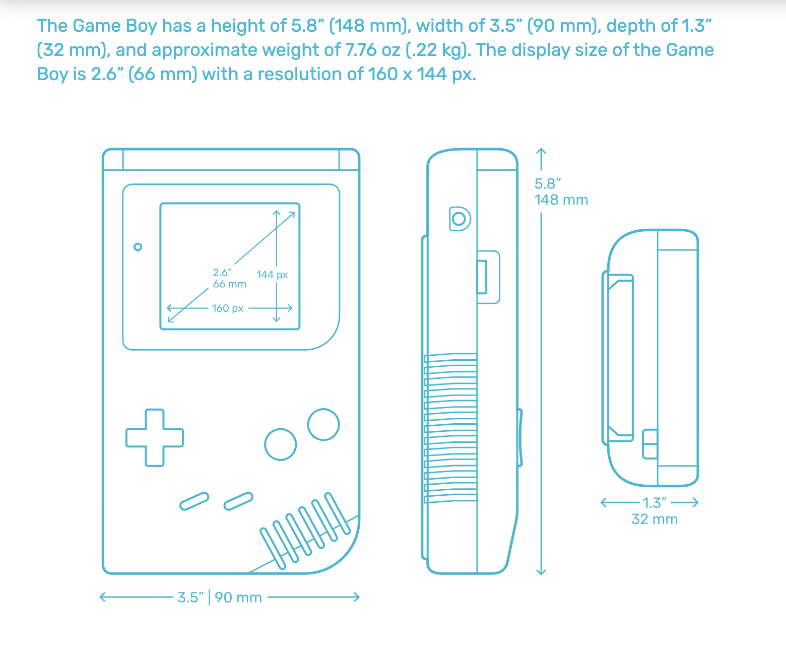
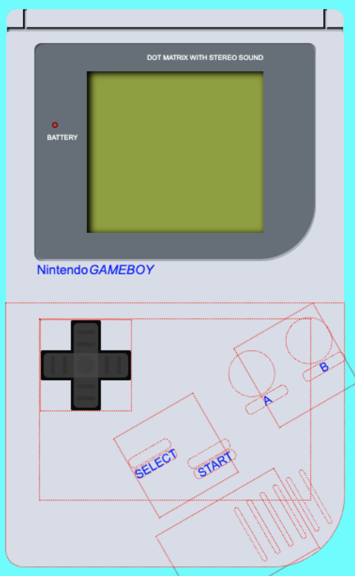
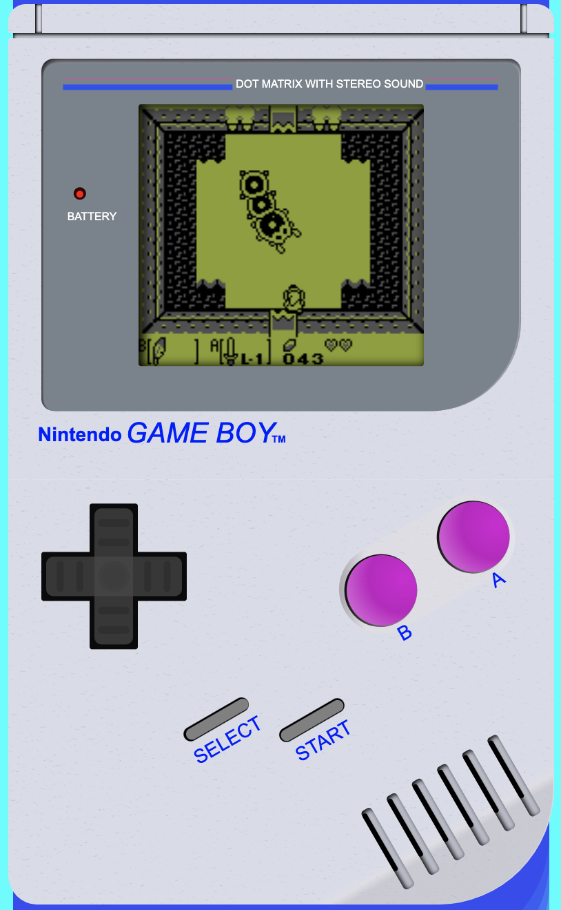
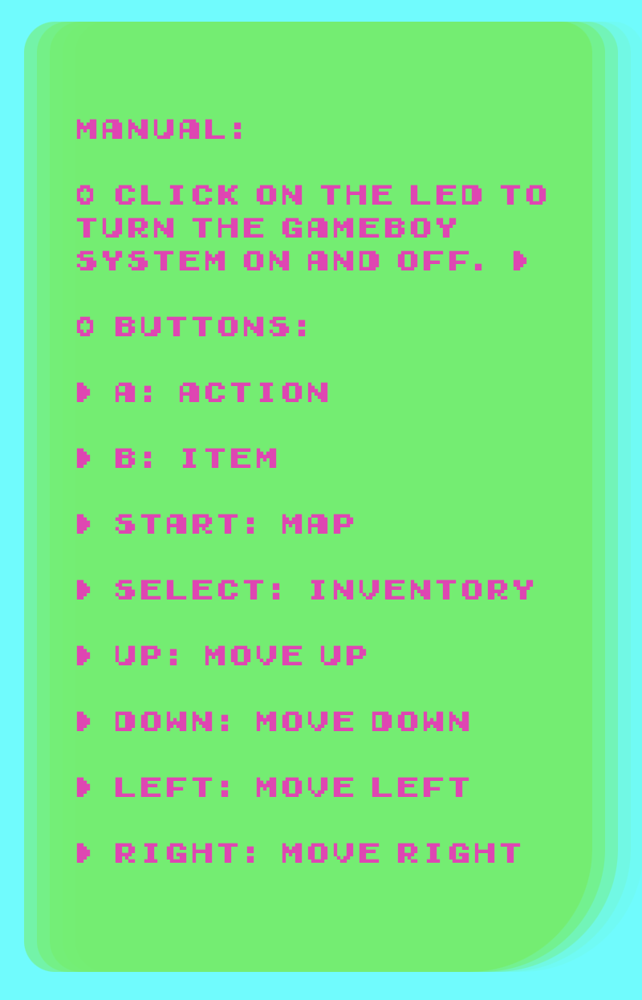

# GAME BOY Classic (1989)

Dibujo interactivo con un diseño 100% escrito en CSS y Flexbox partiendo de las medidas orignales de la base de la consola, convertidas de mm a rem. La consola se puede encencer pulsando el led, mostrando el logo de Nintendo con el mítico sonido de encendido (...y de apagado) los botones muestran imágenes del cartucho Zelda: Link's Awakening (Nintendo, 1993) en pantalla.

### Despliegue en Github Pages

https://paco-fuentes.github.io/btc-geekshubs-21092023-proyecto-2/

## Tabla de contenidos
* [💻 Tecnologías utilizadas](#tecnologías-utilizadas)
* [:pick: Desarrollo](#desarrollo)
* [🕹️ Manual](#manual)
* [💡 Observaciones](#observaciones)
* [📃 Licencia](#licencia)

### Tecnologías utilizadas:

## Desarrollo:

Para este proyecto me he propuesto profundizar en el aprendizaje de CSS investigando flexbox principalmente y su estructura de contenedores así como las relaciones entre estos.

Tambien he experimentado con texturas, blendmodes, sombreados, gradientes y sistemas de medida.

El dibujo parte de las medidas 148x90mm que pasadas a rem (1rem == 16px) son 37x22.5rem, a partir de aquí el dibujo se basó en la observación de un modelo.  

Finalmente para la parte de interactividad he decidido mantener el código propuesto para el ejercicio, sin ir mucho más a allá en la investigación del DOM, y sí en CSS para dejarlo más asentado como conocimiento. 

Para solucionar la interactividad con el on / off y el cambio de imagen he recurrido a un truco que aprendí cuando usaba Arduino con el cual convierto un pulsador en un interruptor guardando el estado anterior y comprandolo con el actual.

He decidio no usar vídeos o .gif de momento para mejorar la experiencia de usuario, la interacción fluida con la interfaz, y en su lugar he dejado imagenes estaticas con la resolución real de la pantalla de la GAMEBOY (160x144px) pero con los fondos transparentes para que se vea todo el rato el mismo color de fondo y parezca más ese tipo de pantalla.

El cuerpo de la consola tiene una capa de textura "rough plastic surface", aunque no ha quedado todo lo realista que esperaba. : (

## Manual:

## Observaciones:

### Bugs Conocidos a la entrega del proyecto

1. Las imágenes se cargan apretar los botones lo que provoca que no se vea nada durante el lapso de tiempo que dura la carga. Una vez cargadas funcionan conrrectamente.

### Logros y soluciones:

- Solucionado error que se produce al querer mostrar en pantalla letras muy pequeñas, ya que algunos navegadores, por defecto, fuerzan un tamaño mayor que rompia el diseño.

### Mejoras

Quedan pendientes las siguientes propuestas para una V2:

- Jugar con las mácaras en CSS, ya que no he conseguido los resultados buscados.
- Añadir más intercatividad.
- Añadir GIF.
- Mejorar el diseño de la página.

### Licencia

Este proyecto está bajo la Licencia MIT. Consulta el archivo [LICENSE](./LICENSE) para obtener más detalles.

### Autor
Paco Fuentes